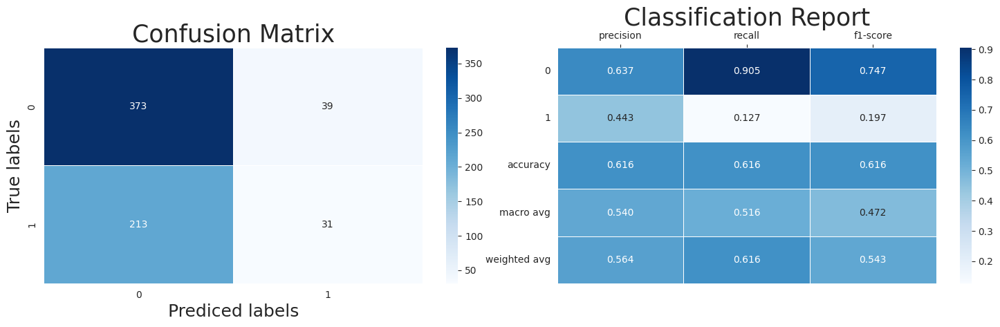
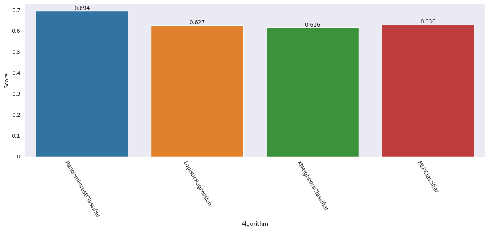

<div style="border:5px solid navy; border-radius:30px; padding: 15px; background-size: cover">
<p><h2 style="color:navy; font-size:300%"><b>Context</b></h2></p>
<p><h5 style="font-size:130%; font-family:Arial ">Access to safe drinking-water is essential to health, a basic human right and a component of effective policy for health protection. This is important as a health and development issue at a national, regional and local level. In some regions, it has been shown that investments in water supply and sanitation can yield a net economic benefit, since the reductions in adverse health effects and health care costs outweigh the costs of undertaking the interventions.</h5></p>
<p style="text-align:center">
</div>

<a id="1"></a>
<h1><b><p style="background-image: url(https://i.postimg.cc/ZK8sS4cQ/Free-Wallpaper-Cartoon-Blue-Background-Images-Cartoon-Blue-Watercolor-Background-Material-Ocean.png);font-family:tahoma;font-size:120%;color:Navy;text-align:center;border-radius:15px 50px; padding:7px; border:solid 2px #09375b; box-shadow: 10px 10px 10px #042b4c"> Table Of Content</p></b></h1>

<a id="content"></a>    
<div style="border-radius:20px; padding: 15px; font-size:100%; text-align:left; background-image: url(https://i.postimg.cc/jS2CydLw/Free-Wallpaper-Cartoon-Blue-Background-Images-Cartoon-Blue-Watercolor-Background-Material-Ocean.jpg); background-size: cover">

<h2><span style="text-align:center; font-weight:bolder; color:navy; font-size:130%">Table of Contents:</span></h2>

 * **[Step 1 | Python Libraries](#setup)**
    -  [1.1 | Import Libraries](#import)
    -  [1.2 | Library configurations](#config)
 *  **[Step 2 | Data](#data)**
    -  [2.1 | Importing Data](#load_data)
    -  [2.2 | Data Informations](#info)
    -  [2.3 | Columns Explanation](#col)
 *  **[Step 3 | visualizations](#visualizations)**
    -  [3.1 | Plots](#plots)
    -  [3.2 | Coorelations](#corr)
 *  **[Step 4 | Preprocessing](#prep)**
    -  [4.1 | Missing Values Handling](#missing)
    -  [4.2 | Normalization](#norm)
 *  **[Step 5 | Modeling](#ml)**
    -  [5.1 | Initialization](#init)
    -  [5.2 | LogisticRegression](#lr)
    -  [5.3 | RandomForestClassifier](#rf)
    -  [5.4 | MLPClassifier](#mlp)
    -  [5.5 | KNeighborsClassifier](#knn)
    -  [5.6 | Result](#result)
 *  **[Author](#author)**

<a id="setup"></a>
<h1><b><p style="background-image: url(https://i.postimg.cc/ZK8sS4cQ/Free-Wallpaper-Cartoon-Blue-Background-Images-Cartoon-Blue-Watercolor-Background-Material-Ocean.png);font-family:tahoma;font-size:120%;color:navy;text-align:center;border-radius:15px 50px; padding:7px; border:solid 2px #09375b; box-shadow: 10px 10px 10px #042b4c">Step1 | Python Libraries</p></b></h1>

[🏠 Tabel of Contents](#content)

<a id="import"></a>
<h2><b><span style="color:navy">💧 Step 1.1 | </span><span style="color:blue">Import Libraries</span></b></h2>


```python
import numpy as np
import pandas as pd
import seaborn as sns
import matplotlib.pyplot as plt
from termcolor import colored
import warnings

from sklearn.preprocessing import MinMaxScaler
from sklearn import metrics
from sklearn.model_selection import train_test_split, GridSearchCV
from sklearn.linear_model import LogisticRegression
from sklearn.ensemble import RandomForestClassifier
from sklearn.neural_network import MLPClassifier
from sklearn.neighbors import KNeighborsClassifier
print(colored('\nAll libraries imported succesfully', 'green'))
```

    
    All libraries imported succesfully
    

<a id="config"></a>
<h2><b><span style="color:navy">💧 Step 1.2 | </span><span style="color:blue">Library configurations</span></b></h2>


knn = KNeighborsClassifier()
knn_cv = GridSearchCV(estimator=knn, cv=10, param_grid=parameters).fit(X_train, y_train)

print(colored('Tuned hyper parameters :\n{}'.format(knn_cv.best_params_), 'blue'))
```

    Tuned hyper parameters :
    {'n_neighbors': 35, 'p': 1, 'weights': 'distance'}
    


```python
knn = KNeighborsClassifier(**knn_cv.best_params_).fit(X_train, y_train)

y_pred_knn = knn.predict(X_test)

knn_score = round(knn.score(X_test, y_test), 3)
print(colored('KNeighborsClassifier Score : {}'.format(knn_score), 'green'))
```

    KNeighborsClassifier Score : 0.616
    


```python
plot_result(y_pred_knn)
```


    

    


<a id="result"></a>
<h2><b><span style="color:navy">💧 Step 5.6 | </span><span style="color:blue">Result</span></b></h2>


```python
result = pd.DataFrame({
    'Algorithm' : ['RandomForestClassifier', 'LogisticRegression', 'KNeighborsClassifier', 'MLPClassifier'],
    'Score' : [rf_score, lr_score,  knn_score, mlp_score]
})


result.style.background_gradient()
```


<style type="text/css">
#T_01d28_row0_col1 {
  background-color: #023858;
  color: #f1f1f1;
}
#T_01d28_row1_col1 {
  background-color: #e8e4f0;
  color: #000000;
}
#T_01d28_row2_col1 {
  background-color: #fff7fb;
  color: #000000;
}
#T_01d28_row3_col1 {
  background-color: #e0deed;
  color: #000000;
}
</style>
<table id="T_01d28">
  <thead>
    <tr>
      <th class="blank level0" >&nbsp;</th>
      <th id="T_01d28_level0_col0" class="col_heading level0 col0" >Algorithm</th>
      <th id="T_01d28_level0_col1" class="col_heading level0 col1" >Score</th>
    </tr>
  </thead>
  <tbody>
    <tr>
      <th id="T_01d28_level0_row0" class="row_heading level0 row0" >0</th>
      <td id="T_01d28_row0_col0" class="data row0 col0" >RandomForestClassifier</td>
      <td id="T_01d28_row0_col1" class="data row0 col1" >0.694000</td>
    </tr>
    <tr>
      <th id="T_01d28_level0_row1" class="row_heading level0 row1" >1</th>
      <td id="T_01d28_row1_col0" class="data row1 col0" >LogisticRegression</td>
      <td id="T_01d28_row1_col1" class="data row1 col1" >0.627000</td>
    </tr>
    <tr>
      <th id="T_01d28_level0_row2" class="row_heading level0 row2" >2</th>
      <td id="T_01d28_row2_col0" class="data row2 col0" >KNeighborsClassifier</td>
      <td id="T_01d28_row2_col1" class="data row2 col1" >0.616000</td>
    </tr>
    <tr>
      <th id="T_01d28_level0_row3" class="row_heading level0 row3" >3</th>
      <td id="T_01d28_row3_col0" class="data row3 col0" >MLPClassifier</td>
      <td id="T_01d28_row3_col1" class="data row3 col1" >0.630000</td>
    </tr>
  </tbody>
</table>


```python
fig, ax = plt.subplots(1, 1, figsize=(15, 5))

sns.barplot(x='Algorithm', y='Score', data=result)
ax.bar_label(ax.containers[0], fmt='%.3f')
ax.set_xticklabels(labels=result.Algorithm, rotation=300)
plt.show()
```


    

    


<div style="font-size:120%; font-weight:500; background-color:#e6e6ff">
    <p>
        ➡️ Best algorithm is <code>RandomForestClassifier</code> with score=0.688
    </p>
</div>


<a id="author"></a>    
<div style="border-radius:10px; padding: 15px; font-size:100%; text-align:left; background-image: url(https://i.postimg.cc/nz8hcrSB/Free-Wallpaper-Cartoon-Blue-Background-Images-Cartoon-Blue-Watercolor-Background-Material-Ocean.png); background-size: cover">

<h4 align="left"><span style="font-weight:700; font-size:150%"><font color=#d10202>Author:</font><font color=navy> Nima Pourmoradi</font></span></h4>
<h6 align="left"><font color=#ff6200><a href='https://github.com/NimaPourmoradi'>github: https://github.com/NimaPourmoradi</font></h6>
<h6 align="left"><font color=#ff6200><a href='https://www.kaggle.com/nimapourmoradi'>kaggle : https://www.kaggle.com/nimapourmoradi</a></font></h6>
<h6 align="left"><font color=#ff6200><a href='https://www.linkedin.com/in/nima-pourmoradi-081949288/'>linkedin : www.linkedin.com/in/nima-pourmoradi</a></font></h6>
<h6 align="left"><font color=#ff6200><a href='https://t.me/Nima_Pourmoradi'>Telegram : https://t.me/Nima_Pourmoradi</a></font></h6>
