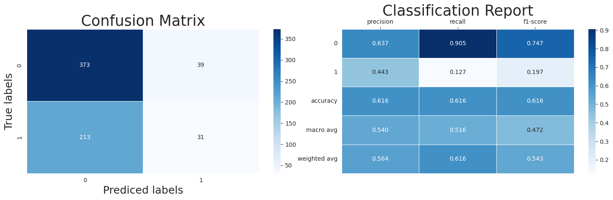

<div style="border:5px solid navy; border-radius:30px; padding: 15px; background-size: cover">
<p><h2 style="color:navy; font-size:300%"><b>Context</b></h2></p>
<p><h5 style="font-size:130%; font-family:Arial ">Access to safe drinking-water is essential to health, a basic human right and a component of effective policy for health protection. This is important as a health and development issue at a national, regional and local level. In some regions, it has been shown that investments in water supply and sanitation can yield a net economic benefit, since the reductions in adverse health effects and health care costs outweigh the costs of undertaking the interventions.</h5></p>
<p style="text-align:center">
</div>

<a id="1"></a>
<h1><b><p style="background-image: url(https://i.postimg.cc/ZK8sS4cQ/Free-Wallpaper-Cartoon-Blue-Background-Images-Cartoon-Blue-Watercolor-Background-Material-Ocean.png);font-family:tahoma;font-size:120%;color:Navy;text-align:center;border-radius:15px 50px; padding:7px; border:solid 2px #09375b; box-shadow: 10px 10px 10px #042b4c"> Table Of Content</p></b></h1>

<a id="content"></a>    
<div style="border-radius:20px; padding: 15px; font-size:100%; text-align:left; background-image: url(https://i.postimg.cc/jS2CydLw/Free-Wallpaper-Cartoon-Blue-Background-Images-Cartoon-Blue-Watercolor-Background-Material-Ocean.jpg); background-size: cover">

<h2><span style="text-align:center; font-weight:bolder; color:navy; font-size:130%">Table of Contents:</span></h2>

 * **[Step 1 | Python Libraries](#setup)**
    -  [1.1 | Import Libraries](#import)
    -  [1.2 | Library configurations](#config)
 *  **[Step 2 | Data](#data)**
    -  [2.1 | Importing Data](#load_data)
    -  [2.2 | Data Informations](#info)
    -  [2.3 | Columns Explanation](#col)
 *  **[Step 3 | visualizations](#visualizations)**
    -  [3.1 | Plots](#plots)
    -  [3.2 | Coorelations](#corr)
 *  **[Step 4 | Preprocessing](#prep)**
    -  [4.1 | Missing Values Handling](#missing)
    -  [4.2 | Normalization](#norm)
 *  **[Step 5 | Modeling](#ml)**
    -  [5.1 | Initialization](#init)
    -  [5.2 | LogisticRegression](#lr)
    -  [5.3 | RandomForestClassifier](#rf)
    -  [5.4 | MLPClassifier](#mlp)
    -  [5.5 | KNeighborsClassifier](#knn)
    -  [5.6 | Result](#result)
 *  **[Author](#author)**

<a id="setup"></a>
<h1><b><p style="background-image: url(https://i.postimg.cc/ZK8sS4cQ/Free-Wallpaper-Cartoon-Blue-Background-Images-Cartoon-Blue-Watercolor-Background-Material-Ocean.png);font-family:tahoma;font-size:120%;color:navy;text-align:center;border-radius:15px 50px; padding:7px; border:solid 2px #09375b; box-shadow: 10px 10px 10px #042b4c">Step1 | Python Libraries</p></b></h1>

[🏠 Tabel of Contents](#content)

<a id="import"></a>
<h2><b><span style="color:navy">💧 Step 1.1 | </span><span style="color:blue">Import Libraries</span></b></h2>


```python
import numpy as np
import pandas as pd
import seaborn as sns
import matplotlib.pyplot as plt
from termcolor import colored
import warnings

from sklearn.preprocessing import MinMaxScaler
from sklearn import metrics
from sklearn.model_selection import train_test_split, GridSearchCV
from sklearn.linear_model import LogisticRegression
from sklearn.ensemble import RandomForestClassifier
from sklearn.neural_network import MLPClassifier
from sklearn.neighbors import KNeighborsClassifier
print(colored('\nAll libraries imported succesfully', 'green'))
```

    
    All libraries imported succesfully
    

<a id="config"></a>
<h2><b><span style="color:navy">💧 Step 1.2 | </span><span style="color:blue">Library configurations</span></b></h2>


```python
pd.options.mode.copy_on_write = True # Allow re-write on variable
sns.set_style('darkgrid') # Seaborn style
warnings.filterwarnings('ignore') # Ignore warnings
pd.set_option('display.max_columns', None) # Setting this option will print all collumns of a dataframe
pd.set_option('display.max_colwidth', None) # Setting this option will print all of the data in a feature
```


```python
print(colored('\nAll libraries Configed succesfully.', 'green'))
```

    
    All libraries Configed succesfully.
    

<a id="data"></a>
<h1><b><p style="background-image: url(https://i.postimg.cc/ZK8sS4cQ/Free-Wallpaper-Cartoon-Blue-Background-Images-Cartoon-Blue-Watercolor-Background-Material-Ocean.png);font-family:tahoma;font-size:120%;color:navy;text-align:center;border-radius:15px 50px; padding:7px; border:solid 2px #09375b; box-shadow: 10px 10px 10px #042b4c">Step2 | Data</p></b></h1>

[🏠 Tabel of Contents](#content)

<a id="load_data"></a>
<h2><b><span style="color:navy">💧 Step 2.1 | </span><span style="color:blue">Importing Data</span></b></h2>


```python
# import data with pandas
data = pd.read_csv('/kaggle/input/water-potability/water_potability.csv')
data.head()
```


<div>
<style scoped>
    .dataframe tbody tr th:only-of-type {
        vertical-align: middle;
    }

    .dataframe tbody tr th {
        vertical-align: top;
    }

    .dataframe thead th {
        text-align: right;
    }
</style>
<table border="1" class="dataframe">
  <thead>
    <tr style="text-align: right;">
      <th></th>
      <th>ph</th>
      <th>Hardness</th>
      <th>Solids</th>
      <th>Chloramines</th>
      <th>Sulfate</th>
      <th>Conductivity</th>
      <th>Organic_carbon</th>
      <th>Trihalomethanes</th>
      <th>Turbidity</th>
      <th>Potability</th>
    </tr>
  </thead>
  <tbody>
    <tr>
      <th>0</th>
      <td>NaN</td>
      <td>204.890455</td>
      <td>20791.318981</td>
      <td>7.300212</td>
      <td>368.516441</td>
      <td>564.308654</td>
      <td>10.379783</td>
      <td>86.990970</td>
      <td>2.963135</td>
      <td>0</td>
    </tr>
    <tr>
      <th>1</th>
      <td>3.716080</td>
      <td>129.422921</td>
      <td>18630.057858</td>
      <td>6.635246</td>
      <td>NaN</td>
      <td>592.885359</td>
      <td>15.180013</td>
      <td>56.329076</td>
      <td>4.500656</td>
      <td>0</td>
    </tr>
    <tr>
      <th>2</th>
      <td>8.099124</td>
      <td>224.236259</td>
      <td>19909.541732</td>
      <td>9.275884</td>
      <td>NaN</td>
      <td>418.606213</td>
      <td>16.868637</td>
      <td>66.420093</td>
      <td>3.055934</td>
      <td>0</td>
    </tr>
    <tr>
      <th>3</th>
      <td>8.316766</td>
      <td>214.373394</td>
      <td>22018.417441</td>
      <td>8.059332</td>
      <td>356.886136</td>
      <td>363.266516</td>
      <td>18.436524</td>
      <td>100.341674</td>
      <td>4.628771</td>
      <td>0</td>
    </tr>
    <tr>
      <th>4</th>
      <td>9.092223</td>
      <td>181.101509</td>
      <td>17978.986339</td>
      <td>6.546600</td>
      <td>310.135738</td>
      <td>398.410813</td>
      <td>11.558279</td>
      <td>31.997993</td>
      <td>4.075075</td>
      <td>0</td>
    </tr>
  </tbody>
</table>
</div>


<a id="info"></a>
<h2><b><span style="color:navy">💧 Step 2.2 | </span><span style="color:blue">Data Informations</span></b></h2>


```python
data.info()
```

    <class 'pandas.core.frame.DataFrame'>
    RangeIndex: 3276 entries, 0 to 3275
    Data columns (total 10 columns):
     #   Column           Non-Null Count  Dtype  
    ---  ------           --------------  -----  
     0   ph               2785 non-null   float64
     1   Hardness         3276 non-null   float64
     2   Solids           3276 non-null   float64
     3   Chloramines      3276 non-null   float64
     4   Sulfate          2495 non-null   float64
     5   Conductivity     3276 non-null   float64
     6   Organic_carbon   3276 non-null   float64
     7   Trihalomethanes  3114 non-null   float64
     8   Turbidity        3276 non-null   float64
     9   Potability       3276 non-null   int64  
    dtypes: float64(9), int64(1)
    memory usage: 256.1 KB
    


```python
data.describe().loc[['min', '50%', 'mean', 'max', 'std']].T.style.background_gradient(axis=1)
```


<style type="text/css">
#T_8743b_row0_col0, #T_8743b_row1_col4, #T_8743b_row2_col0, #T_8743b_row3_col0, #T_8743b_row4_col4, #T_8743b_row5_col4, #T_8743b_row6_col0, #T_8743b_row7_col0, #T_8743b_row8_col4, #T_8743b_row9_col0, #T_8743b_row9_col1 {
  background-color: #fff7fb;
  color: #000000;
}
#T_8743b_row0_col1 {
  background-color: #73a9cf;
  color: #f1f1f1;
}
#T_8743b_row0_col2, #T_8743b_row5_col1 {
  background-color: #71a8ce;
  color: #f1f1f1;
}
#T_8743b_row0_col3, #T_8743b_row1_col3, #T_8743b_row2_col3, #T_8743b_row3_col3, #T_8743b_row4_col3, #T_8743b_row5_col3, #T_8743b_row6_col3, #T_8743b_row7_col3, #T_8743b_row8_col3, #T_8743b_row9_col3 {
  background-color: #023858;
  color: #f1f1f1;
}
#T_8743b_row0_col4 {
  background-color: #eee8f3;
  color: #000000;
}
#T_8743b_row1_col0 {
  background-color: #f8f1f8;
  color: #000000;
}
#T_8743b_row1_col1, #T_8743b_row1_col2 {
  background-color: #549cc7;
  color: #f1f1f1;
}
#T_8743b_row2_col1 {
  background-color: #b3c3de;
  color: #000000;
}
#T_8743b_row2_col2 {
  background-color: #acc0dd;
  color: #000000;
}
#T_8743b_row2_col4 {
  background-color: #e9e5f1;
  color: #000000;
}
#T_8743b_row3_col1, #T_8743b_row3_col2 {
  background-color: #65a3cb;
  color: #f1f1f1;
}
#T_8743b_row3_col4 {
  background-color: #f1ebf4;
  color: #000000;
}
#T_8743b_row4_col0 {
  background-color: #dbdaeb;
  color: #000000;
}
#T_8743b_row4_col1 {
  background-color: #2786bb;
  color: #f1f1f1;
}
#T_8743b_row4_col2 {
  background-color: #2685bb;
  color: #f1f1f1;
}
#T_8743b_row5_col0 {
  background-color: #e7e3f0;
  color: #000000;
}
#T_8743b_row5_col2 {
  background-color: #6da6cd;
  color: #f1f1f1;
}
#T_8743b_row6_col1 {
  background-color: #84b0d3;
  color: #f1f1f1;
}
#T_8743b_row6_col2 {
  background-color: #83afd3;
  color: #f1f1f1;
}
#T_8743b_row6_col4 {
  background-color: #f9f2f8;
  color: #000000;
}
#T_8743b_row7_col1, #T_8743b_row7_col2, #T_8743b_row8_col1, #T_8743b_row8_col2 {
  background-color: #63a2cb;
  color: #f1f1f1;
}
#T_8743b_row7_col4 {
  background-color: #ece7f2;
  color: #000000;
}
#T_8743b_row8_col0 {
  background-color: #eee9f3;
  color: #000000;
}
#T_8743b_row9_col2 {
  background-color: #a1bbda;
  color: #000000;
}
#T_8743b_row9_col4 {
  background-color: #79abd0;
  color: #f1f1f1;
}
</style>
<table id="T_8743b">
  <thead>
    <tr>
      <th class="blank level0" >&nbsp;</th>
      <th id="T_8743b_level0_col0" class="col_heading level0 col0" >min</th>
      <th id="T_8743b_level0_col1" class="col_heading level0 col1" >50%</th>
      <th id="T_8743b_level0_col2" class="col_heading level0 col2" >mean</th>
      <th id="T_8743b_level0_col3" class="col_heading level0 col3" >max</th>
      <th id="T_8743b_level0_col4" class="col_heading level0 col4" >std</th>
    </tr>
  </thead>
  <tbody>
    <tr>
      <th id="T_8743b_level0_row0" class="row_heading level0 row0" >ph</th>
      <td id="T_8743b_row0_col0" class="data row0 col0" >0.000000</td>
      <td id="T_8743b_row0_col1" class="data row0 col1" >7.036752</td>
      <td id="T_8743b_row0_col2" class="data row0 col2" >7.080795</td>
      <td id="T_8743b_row0_col3" class="data row0 col3" >14.000000</td>
      <td id="T_8743b_row0_col4" class="data row0 col4" >1.594320</td>
    </tr>
    <tr>
      <th id="T_8743b_level0_row1" class="row_heading level0 row1" >Hardness</th>
      <td id="T_8743b_row1_col0" class="data row1 col0" >47.432000</td>
      <td id="T_8743b_row1_col1" class="data row1 col1" >196.967627</td>
      <td id="T_8743b_row1_col2" class="data row1 col2" >196.369496</td>
      <td id="T_8743b_row1_col3" class="data row1 col3" >323.124000</td>
      <td id="T_8743b_row1_col4" class="data row1 col4" >32.879761</td>
    </tr>
    <tr>
      <th id="T_8743b_level0_row2" class="row_heading level0 row2" >Solids</th>
      <td id="T_8743b_row2_col0" class="data row2 col0" >320.942611</td>
      <td id="T_8743b_row2_col1" class="data row2 col1" >20927.833607</td>
      <td id="T_8743b_row2_col2" class="data row2 col2" >22014.092526</td>
      <td id="T_8743b_row2_col3" class="data row2 col3" >61227.196008</td>
      <td id="T_8743b_row2_col4" class="data row2 col4" >8768.570828</td>
    </tr>
    <tr>
      <th id="T_8743b_level0_row3" class="row_heading level0 row3" >Chloramines</th>
      <td id="T_8743b_row3_col0" class="data row3 col0" >0.352000</td>
      <td id="T_8743b_row3_col1" class="data row3 col1" >7.130299</td>
      <td id="T_8743b_row3_col2" class="data row3 col2" >7.122277</td>
      <td id="T_8743b_row3_col3" class="data row3 col3" >13.127000</td>
      <td id="T_8743b_row3_col4" class="data row3 col4" >1.583085</td>
    </tr>
    <tr>
      <th id="T_8743b_level0_row4" class="row_heading level0 row4" >Sulfate</th>
      <td id="T_8743b_row4_col0" class="data row4 col0" >129.000000</td>
      <td id="T_8743b_row4_col1" class="data row4 col1" >333.073546</td>
      <td id="T_8743b_row4_col2" class="data row4 col2" >333.775777</td>
      <td id="T_8743b_row4_col3" class="data row4 col3" >481.030642</td>
      <td id="T_8743b_row4_col4" class="data row4 col4" >41.416840</td>
    </tr>
    <tr>
      <th id="T_8743b_level0_row5" class="row_heading level0 row5" >Conductivity</th>
      <td id="T_8743b_row5_col0" class="data row5 col0" >181.483754</td>
      <td id="T_8743b_row5_col1" class="data row5 col1" >421.884968</td>
      <td id="T_8743b_row5_col2" class="data row5 col2" >426.205111</td>
      <td id="T_8743b_row5_col3" class="data row5 col3" >753.342620</td>
      <td id="T_8743b_row5_col4" class="data row5 col4" >80.824064</td>
    </tr>
    <tr>
      <th id="T_8743b_level0_row6" class="row_heading level0 row6" >Organic_carbon</th>
      <td id="T_8743b_row6_col0" class="data row6 col0" >2.200000</td>
      <td id="T_8743b_row6_col1" class="data row6 col1" >14.218338</td>
      <td id="T_8743b_row6_col2" class="data row6 col2" >14.284970</td>
      <td id="T_8743b_row6_col3" class="data row6 col3" >28.300000</td>
      <td id="T_8743b_row6_col4" class="data row6 col4" >3.308162</td>
    </tr>
    <tr>
      <th id="T_8743b_level0_row7" class="row_heading level0 row7" >Trihalomethanes</th>
      <td id="T_8743b_row7_col0" class="data row7 col0" >0.738000</td>
      <td id="T_8743b_row7_col1" class="data row7 col1" >66.622485</td>
      <td id="T_8743b_row7_col2" class="data row7 col2" >66.396293</td>
      <td id="T_8743b_row7_col3" class="data row7 col3" >124.000000</td>
      <td id="T_8743b_row7_col4" class="data row7 col4" >16.175008</td>
    </tr>
    <tr>
      <th id="T_8743b_level0_row8" class="row_heading level0 row8" >Turbidity</th>
      <td id="T_8743b_row8_col0" class="data row8 col0" >1.450000</td>
      <td id="T_8743b_row8_col1" class="data row8 col1" >3.955028</td>
      <td id="T_8743b_row8_col2" class="data row8 col2" >3.966786</td>
      <td id="T_8743b_row8_col3" class="data row8 col3" >6.739000</td>
      <td id="T_8743b_row8_col4" class="data row8 col4" >0.780382</td>
    </tr>
    <tr>
      <th id="T_8743b_level0_row9" class="row_heading level0 row9" >Potability</th>
      <td id="T_8743b_row9_col0" class="data row9 col0" >0.000000</td>
      <td id="T_8743b_row9_col1" class="data row9 col1" >0.000000</td>
      <td id="T_8743b_row9_col2" class="data row9 col2" >0.390110</td>
      <td id="T_8743b_row9_col3" class="data row9 col3" >1.000000</td>
      <td id="T_8743b_row9_col4" class="data row9 col4" >0.487849</td>
    </tr>
  </tbody>
</table>


```python
columns_name = data.columns
for index, col_name in enumerate(columns_name):
    print(index, col_name)
```

    0 ph
    1 Hardness
    2 Solids
    3 Chloramines
    4 Sulfate
    5 Conductivity
    6 Organic_carbon
    7 Trihalomethanes
    8 Turbidity
    9 Potability
    

<a id="col"></a>
<h2><b><span style="color:navy">💧 Step 2.3 | </span><span style="color:blue">Columns Explanation</span></b></h2>

<div style="border:5px solid navy; border-radius:20px; padding: 15px; font-family:Arial">
<h3><b>1. pH value:</b></h3>
PH is an important parameter in evaluating the acid–base balance of water. It is also the indicator of acidic or alkaline condition of water status. WHO has recommended maximum permissible limit of pH from 6.5 to 8.5. The current investigation ranges were 6.52–6.83 which are in the range of WHO standards.

<h3><b>2. Hardness:</b></h3>
Hardness is mainly caused by calcium and magnesium salts. These salts are dissolved from geologic deposits through which water travels. The length of time water is in contact with hardness producing material helps determine how much hardness there is in raw water. Hardness was originally defined as the capacity of water to precipitate soap caused by Calcium and Magnesium.

<h3><b>3. Solids (Total dissolved solids - TDS):</b></h3>
Water has the ability to dissolve a wide range of inorganic and some organic minerals or salts such as potassium, calcium, sodium, bicarbonates, chlorides, magnesium, sulfates etc. These minerals produced un-wanted taste and diluted color in appearance of water. This is the important parameter for the use of water. The water with high TDS value indicates that water is highly mineralized. Desirable limit for TDS is 500 mg/l and maximum limit is 1000 mg/l which prescribed for drinking purpose.

<h3><b>4. Chloramines:</b></h3>
Chlorine and chloramine are the major disinfectants used in public water systems. Chloramines are most commonly formed when ammonia is added to chlorine to treat drinking water. Chlorine levels up to 4 milligrams per liter (mg/L or 4 parts per million (ppm)) are considered safe in drinking water.

<h3><b>5. Sulfate:</b></h3>
Sulfates are naturally occurring substances that are found in minerals, soil, and rocks. They are present in ambient air, groundwater, plants, and food. The principal commercial use of sulfate is in the chemical industry. Sulfate concentration in seawater is about 2,700 milligrams per liter (mg/L). It ranges from 3 to 30 mg/L in most freshwater supplies, although much higher concentrations (1000 mg/L) are found in some geographic locations.

<h3><b>6. Conductivity:</b></h3>
Pure water is not a good conductor of electric current rather’s a good insulator. Increase in ions concentration enhances the electrical conductivity of water. Generally, the amount of dissolved solids in water determines the electrical conductivity. Electrical conductivity (EC) actually measures the ionic process of a solution that enables it to transmit current. According to WHO standards, EC value should not exceeded 400 μS/cm.

<h3><b>7. Organic_carbon:</b></h3>
Total Organic Carbon (TOC) in source waters comes from decaying natural organic matter (NOM) as well as synthetic sources. TOC is a measure of the total amount of carbon in organic compounds in pure water. According to US EPA < 2 mg/L as TOC in treated / drinking water, and < 4 mg/Lit in source water which is use for treatment.

<h3><b>8. Trihalomethanes:</b></h3>
THMs are chemicals which may be found in water treated with chlorine. The concentration of THMs in drinking water varies according to the level of organic material in the water, the amount of chlorine required to treat the water, and the temperature of the water that is being treated. THM levels up to 80 ppm is considered safe in drinking water.

<h3><b>9. Turbidity:</b></h3>
The turbidity of water depends on the quantity of solid matter present in the suspended state. It is a measure of light emitting properties of water and the test is used to indicate the quality of waste discharge with respect to colloidal matter. The mean turbidity value obtained for Wondo Genet Campus (0.98 NTU) is lower than the WHO recommended value of 5.00 NTU.

<h3><b>10. Potability:</b></h3>
Indicates if water is safe for human consumption where 1 means Potable and 0 means Not potable.
</div>

<a id="visualizations"></a>
<h1><b><p style="background-image: url(https://i.postimg.cc/ZK8sS4cQ/Free-Wallpaper-Cartoon-Blue-Background-Images-Cartoon-Blue-Watercolor-Background-Material-Ocean.png);font-family:tahoma;font-size:120%;color:navy;text-align:center;border-radius:15px 50px; padding:7px; border:solid 2px #09375b; box-shadow: 10px 10px 10px #042b4c">Step3 | Visualizations</p></b></h1>

[🏠 Tabel of Contents](#content)

<a id="plots"></a>
<h2><b><span style="color:navy">💧 Step 3.1 | </span><span style="color:blue">Plots</span></b></h2>


```python
fig, ax = plt.subplots(9, 1, figsize=(10, 20))
fig.subplots_adjust(hspace=0.75)
for i in range(9) :
    # Ax
    sns.boxplot(x=columns_name[i], data=data, ax=ax[i])
```


    

    


```python
tar = data['Potability'].value_counts()
print(tar)

plt.pie(tar, labels=[0, 1], explode=[0, 0.01], autopct='%.f%%', shadow=True)
plt.legend()
plt.show()
```

    Potability
    0    1998
    1    1278
    Name: count, dtype: int64
    


    

    


<div style="font-size:130%; font-weight:500; background-color:#edfeff">➡️ It seeps there is no outlier and noise data in dataframe.</div>

<a id="corr"></a>
<h2><b><span style="color:navy">💧 Step 3.2 | </span><span style="color:blue">Correlation</span></b></h2>


```python
corr = data.corr()
plt.figure(figsize=(10, 5))
sns.heatmap(corr, annot=True, fmt='.2f', linewidths=0.5, linecolor='white', mask=np.triu(corr), cmap='Blues')
plt.show()
```


    

    


```python
sns.pairplot(data, hue='Potability', corner=True, palette='Blues')
plt.show()
```


    

    


<div style="font-size:130%; font-weight:500; background-color:#edfeff">➡️ Seems there is no logical correlation in our data.</div>

<a id="prep"></a>
<h1><b><p style="background-image: url(https://i.postimg.cc/ZK8sS4cQ/Free-Wallpaper-Cartoon-Blue-Background-Images-Cartoon-Blue-Watercolor-Background-Material-Ocean.png);font-family:tahoma;font-size:120%;color:navy;text-align:center;border-radius:15px 50px; padding:7px; border:solid 2px #09375b; box-shadow: 10px 10px 10px #042b4c">Step4 | Preprocessing</p></b></h1>

[🏠 Tabel of Contents](#content)

<a id="missing"></a>
<h2><b><span style="color:navy">💧 Step 4.1 | </span><span style="color:blue">Missing Values Handling</span></b></h2>


```python
data.isna().sum()
```


    ph                 491
    Hardness             0
    Solids               0
    Chloramines          0
    Sulfate            781
    Conductivity         0
    Organic_carbon       0
    Trihalomethanes    162
    Turbidity            0
    Potability           0
    dtype: int64


```python
print("Number of all samples : ", len(data))
```

    Number of all samples :  3276
    


```python
print('Percentage(%) of nulls for each columns : \n')
print((data.isna().sum()/len(data))*100)
```

    Percentage(%) of nulls for each columns : 
    
    ph                 14.987790
    Hardness            0.000000
    Solids              0.000000
    Chloramines         0.000000
    Sulfate            23.840049
    Conductivity        0.000000
    Organic_carbon      0.000000
    Trihalomethanes     4.945055
    Turbidity           0.000000
    Potability          0.000000
    dtype: float64
    

<div style="font-size:120%; font-weight:500; background-color:#edfeff"><p></p>➡️ Because of larg number of missing values, we replace them with median for each column.</p>

<span>columns with missing values :
 - ph
 - Sulfate
 - Trihalomethanes
</span>
</div>


```python
print("For Potability=1")
data[data.Potability==1][['ph', 'Sulfate', 'Trihalomethanes']].median()
```

    For Potability=1
    


    ph                   7.036752
    Sulfate            331.838167
    Trihalomethanes     66.678214
    dtype: float64


```python
print("For Potability=1")
data[data.Potability==0][['ph', 'Sulfate', 'Trihalomethanes']].median()
```

    For Potability=1
    


    ph                   7.035456
    Sulfate            333.389426
    Trihalomethanes     66.542198
    dtype: float64


<div style="font-size:120%; font-weight:500; background-color:#edfeff"><p></p>➡️ For both Potability=1 and Potability=0, medians are approximately equall.</p>
<p>➡️Replace them all with their meadians</p>
</div>


```python
data['ph'] = data['ph'].fillna(value=data['ph'].median())
data['Sulfate'] = data['Sulfate'].fillna(value=data['Sulfate'].median())
data['Trihalomethanes'] = data['Trihalomethanes'].fillna(value=data['Trihalomethanes'].median())
```


```python
data.isna().sum().sum()
```


    0


<div style="font-size:120%; font-weight:500; background-color:#edfeff">
    <p>
        ➡️ All missing valules handled 👍
    </p>
</div>

<a id="norm"></a>
<h2><b><span style="color:navy">💧 Step 4.1 | </span><span style="color:blue">Normalization</span></b></h2>

<div style="font-size:120%; font-weight:500; background-color:#edfeff">
    <p>
        ➡️ Use <code>Potability</code> as target.  👍
    </p>
    <p>
        ➡️ Using <code>MinMaxScaler()</code> to map values in range [0, 1] (Normalization)
    </p>
</div>


```python
# Define X, y
X = data.drop(columns='Potability')
y = data.Potability
```


```python
scaler = MinMaxScaler(feature_range=(0, 1))
df = pd.DataFrame(scaler.fit_transform(X), columns=X.columns)
df.describe().loc[['min', 'mean', 'std', 'max']].T.style.background_gradient(axis=1)
```


<style type="text/css">
#T_31ac4_row0_col0, #T_31ac4_row1_col0, #T_31ac4_row2_col0, #T_31ac4_row3_col0, #T_31ac4_row4_col0, #T_31ac4_row5_col0, #T_31ac4_row6_col0, #T_31ac4_row7_col0, #T_31ac4_row8_col0 {
  background-color: #fff7fb;
  color: #000000;
}
#T_31ac4_row0_col1 {
  background-color: #71a8ce;
  color: #f1f1f1;
}
#T_31ac4_row0_col2, #T_31ac4_row4_col2 {
  background-color: #f0eaf4;
  color: #000000;
}
#T_31ac4_row0_col3, #T_31ac4_row1_col3, #T_31ac4_row2_col3, #T_31ac4_row3_col3, #T_31ac4_row4_col3, #T_31ac4_row5_col3, #T_31ac4_row6_col3, #T_31ac4_row7_col3, #T_31ac4_row8_col3 {
  background-color: #023858;
  color: #f1f1f1;
}
#T_31ac4_row1_col1 {
  background-color: #60a1ca;
  color: #f1f1f1;
}
#T_31ac4_row1_col2 {
  background-color: #ede8f3;
  color: #000000;
}
#T_31ac4_row2_col1 {
  background-color: #acc0dd;
  color: #000000;
}
#T_31ac4_row2_col2, #T_31ac4_row5_col2 {
  background-color: #e8e4f0;
  color: #000000;
}
#T_31ac4_row3_col1 {
  background-color: #65a3cb;
  color: #f1f1f1;
}
#T_31ac4_row3_col2 {
  background-color: #ede7f2;
  color: #000000;
}
#T_31ac4_row4_col1 {
  background-color: #4c99c5;
  color: #f1f1f1;
}
#T_31ac4_row5_col1 {
  background-color: #91b5d6;
  color: #000000;
}
#T_31ac4_row6_col1 {
  background-color: #83afd3;
  color: #f1f1f1;
}
#T_31ac4_row6_col2, #T_31ac4_row7_col2 {
  background-color: #ece7f2;
  color: #000000;
}
#T_31ac4_row7_col1 {
  background-color: #63a2cb;
  color: #f1f1f1;
}
#T_31ac4_row8_col1 {
  background-color: #7eadd1;
  color: #f1f1f1;
}
#T_31ac4_row8_col2 {
  background-color: #e7e3f0;
  color: #000000;
}
</style>
<table id="T_31ac4">
  <thead>
    <tr>
      <th class="blank level0" >&nbsp;</th>
      <th id="T_31ac4_level0_col0" class="col_heading level0 col0" >min</th>
      <th id="T_31ac4_level0_col1" class="col_heading level0 col1" >mean</th>
      <th id="T_31ac4_level0_col2" class="col_heading level0 col2" >std</th>
      <th id="T_31ac4_level0_col3" class="col_heading level0 col3" >max</th>
    </tr>
  </thead>
  <tbody>
    <tr>
      <th id="T_31ac4_level0_row0" class="row_heading level0 row0" >ph</th>
      <td id="T_31ac4_row0_col0" class="data row0 col0" >0.000000</td>
      <td id="T_31ac4_row0_col1" class="data row0 col1" >0.505300</td>
      <td id="T_31ac4_row0_col2" class="data row0 col2" >0.105003</td>
      <td id="T_31ac4_row0_col3" class="data row0 col3" >1.000000</td>
    </tr>
    <tr>
      <th id="T_31ac4_level0_row1" class="row_heading level0 row1" >Hardness</th>
      <td id="T_31ac4_row1_col0" class="data row1 col0" >0.000000</td>
      <td id="T_31ac4_row1_col1" class="data row1 col1" >0.540231</td>
      <td id="T_31ac4_row1_col2" class="data row1 col2" >0.119263</td>
      <td id="T_31ac4_row1_col3" class="data row1 col3" >1.000000</td>
    </tr>
    <tr>
      <th id="T_31ac4_level0_row2" class="row_heading level0 row2" >Solids</th>
      <td id="T_31ac4_row2_col0" class="data row2 col0" >0.000000</td>
      <td id="T_31ac4_row2_col1" class="data row2 col1" >0.356173</td>
      <td id="T_31ac4_row2_col2" class="data row2 col2" >0.143968</td>
      <td id="T_31ac4_row2_col3" class="data row2 col3" >1.000000</td>
    </tr>
    <tr>
      <th id="T_31ac4_level0_row3" class="row_heading level0 row3" >Chloramines</th>
      <td id="T_31ac4_row3_col0" class="data row3 col0" >0.000000</td>
      <td id="T_31ac4_row3_col1" class="data row3 col1" >0.529963</td>
      <td id="T_31ac4_row3_col2" class="data row3 col2" >0.123921</td>
      <td id="T_31ac4_row3_col3" class="data row3 col3" >1.000000</td>
    </tr>
    <tr>
      <th id="T_31ac4_level0_row4" class="row_heading level0 row4" >Sulfate</th>
      <td id="T_31ac4_row4_col0" class="data row4 col0" >0.000000</td>
      <td id="T_31ac4_row4_col1" class="data row4 col1" >0.581223</td>
      <td id="T_31ac4_row4_col2" class="data row4 col2" >0.102672</td>
      <td id="T_31ac4_row4_col3" class="data row4 col3" >1.000000</td>
    </tr>
    <tr>
      <th id="T_31ac4_level0_row5" class="row_heading level0 row5" >Conductivity</th>
      <td id="T_31ac4_row5_col0" class="data row5 col0" >0.000000</td>
      <td id="T_31ac4_row5_col1" class="data row5 col1" >0.427940</td>
      <td id="T_31ac4_row5_col2" class="data row5 col2" >0.141336</td>
      <td id="T_31ac4_row5_col3" class="data row5 col3" >1.000000</td>
    </tr>
    <tr>
      <th id="T_31ac4_level0_row6" class="row_heading level0 row6" >Organic_carbon</th>
      <td id="T_31ac4_row6_col0" class="data row6 col0" >0.000000</td>
      <td id="T_31ac4_row6_col1" class="data row6 col1" >0.463026</td>
      <td id="T_31ac4_row6_col2" class="data row6 col2" >0.126750</td>
      <td id="T_31ac4_row6_col3" class="data row6 col3" >1.000000</td>
    </tr>
    <tr>
      <th id="T_31ac4_level0_row7" class="row_heading level0 row7" >Trihalomethanes</th>
      <td id="T_31ac4_row7_col0" class="data row7 col0" >0.000000</td>
      <td id="T_31ac4_row7_col1" class="data row7 col1" >0.532763</td>
      <td id="T_31ac4_row7_col2" class="data row7 col2" >0.127939</td>
      <td id="T_31ac4_row7_col3" class="data row7 col3" >1.000000</td>
    </tr>
    <tr>
      <th id="T_31ac4_level0_row8" class="row_heading level0 row8" >Turbidity</th>
      <td id="T_31ac4_row8_col0" class="data row8 col0" >0.000000</td>
      <td id="T_31ac4_row8_col1" class="data row8 col1" >0.475853</td>
      <td id="T_31ac4_row8_col2" class="data row8 col2" >0.147548</td>
      <td id="T_31ac4_row8_col3" class="data row8 col3" >1.000000</td>
    </tr>
  </tbody>
</table>


<a id="model"></a>
<h1><b><p style="background-image: url(https://i.postimg.cc/ZK8sS4cQ/Free-Wallpaper-Cartoon-Blue-Background-Images-Cartoon-Blue-Watercolor-Background-Material-Ocean.png);font-family:tahoma;font-size:120%;color:navy;text-align:center;border-radius:15px 50px; padding:7px; border:solid 2px #09375b; box-shadow: 10px 10px 10px #042b4c">Step5 | Modeling</p></b></h1>

[🏠 Tabel of Contents](#content)

<a id="init"></a>
<h2><b><span style="color:navy">💧 Step 5.1 | </span><span style="color:blue">Initialization</span></b></h2>


```python
X_train, X_test, y_train, y_test = train_test_split(X, y, random_state=0, test_size=0.2)
```


```python
# A function to plot "Confusion Matrix" and "Classification Report"
def plot_result(y_pred) :
    '''
    1) plot Confusion Matrix
    2) plot Classification Report
    '''
    fig, ax = plt.subplots(1, 2, figsize=(15, 4))
    fig.tight_layout()
    #AX left - Confusion Matrix
    cm = metrics.confusion_matrix(y_test, y_pred)
    ax[0]=sns.heatmap(cm, cmap='Blues', annot=True, fmt='', linewidths=0.5, ax=ax[0])
    ax[0].set_xlabel('Prediced labels', fontsize=18)
    ax[0].set_ylabel('True labels', fontsize=18)
    ax[0].set_title('Confusion Matrix', fontsize=25)
    ax[0].xaxis.set_ticklabels(['0', '1'])
    ax[0].yaxis.set_ticklabels(['0', '1'])
    #
    # AX Right - Classification Report
    cr = pd.DataFrame(metrics.classification_report(y_test, y_pred, digits=3, output_dict=True)).T
    cr.drop(columns='support', inplace=True)
    ax[1] = sns.heatmap(cr, cmap='Blues', annot=True, fmt='0.3f', linewidths=0.5, ax=ax[1])
    ax[1].xaxis.tick_top()
    ax[1].set_title('Classification Report', fontsize=25)
    plt.show()
```

<a id="lr"></a>
<h2><b><span style="color:navy">💧 Step 5.2 | </span><span style="color:blue">LogisticRegression</span></b></h2>


```python
# a dictionary to define parameters to test in algorithm
parameters = {
    'C' : [0.001, 1, 1000],
    'class_weight' : ['balanced', None],
    'solver' : ['liblinear', 'sag'],
    'penalty' : ['l2'],
    'n_jobs' : [-1],
}

lr = LogisticRegression()
lr_cv = GridSearchCV(estimator=lr, param_grid=parameters, cv=20).fit(X_train, y_train)

print(colored('Tuned hyper parameters :\n{}'.format(lr_cv.best_params_), 'blue'))
```

    Tuned hyper parameters :
    {'C': 0.001, 'class_weight': None, 'n_jobs': -1, 'penalty': 'l2', 'solver': 'liblinear'}
    


```python
lr = LogisticRegression(**lr_cv.best_params_).fit(X_train, y_train)

y_pred_lr = lr.predict(X_test)

lr_score = round(lr.score(X_test, y_test), 3)
print(colored('LogisticRegression Score : {}'.format(lr_score), 'green'))
```

    LogisticRegression Score : 0.627
    


```python
plot_result(y_pred_lr)
```


    

    


<a id="rf"></a>
<h2><b><span style="color:navy">💧 Step 5.3 | </span><span style="color:blue">RandomForestClassifier</span></b></h2>


```python
# a dictionary to define parameters to test in algorithm
parameters = {
    'n_estimators' : [1000],
    'criterion' : ['log_loss'],
    'max_features' : ['sqrt'],
    'n_jobs' : [-1]
}

rf = RandomForestClassifier()
rf_cv = GridSearchCV(estimator=rf, param_grid=parameters, cv=20).fit(X_train, y_train)
print(colored('Tuned hyper parameters :\n{}'.format(rf_cv.best_params_), 'blue'))
```

    Tuned hyper parameters :
    {'criterion': 'log_loss', 'max_features': 'sqrt', 'n_estimators': 1000, 'n_jobs': -1}
    


```python
rf = RandomForestClassifier(**rf_cv.best_params_).fit(X_train, y_train)

y_pred_rf = rf.predict(X_test)

rf_score = round(rf.score(X_test, y_test), 3)
print(colored('RandomForestClassifier Score : {}'.format(rf_score), 'green'))
```

    RandomForestClassifier Score : 0.694
    


```python
plot_result(y_pred_rf)
```


    

    


<a id="mlp"></a>
<h2><b><span style="color:navy">💧 Step 5.4 | </span><span style="color:blue">MLPClassifier</span></b></h2>


```python
# a dictionary to define parameters to test in algorithm
parameters = {
    'hidden_layer_sizes' : [500],
    'activation' : ['logistic'],
    'alpha' : [0.0001],
    'batch_size' : [200],
    
}

mlp = MLPClassifier()
mlp_cv = GridSearchCV(estimator=mlp, param_grid=parameters, cv=20).fit(X_train, y_train)

print(colored('Tuned hyper parameters :\n{}'.format(mlp_cv.best_params_), 'blue'))
```

    Tuned hyper parameters :
    {'activation': 'logistic', 'alpha': 0.0001, 'batch_size': 200, 'hidden_layer_sizes': 500}
    


```python
mlp = MLPClassifier(**mlp_cv.best_params_).fit(X_train, y_train)

y_pred_mlp = mlp.predict(X_test)

mlp_score = round(mlp.score(X_test, y_test), 3)
print(colored('MLPClassifier Score : {}'.format(mlp_score), 'green'))
```

    MLPClassifier Score : 0.63
    


```python
plot_result(y_pred_mlp)
```


    

    


<a id="knn"></a>
<h2><b><span style="color:navy">💧 Step 5.5 | </span><span style="color:blue">KNeighborsClassifier</span></b></h2>


```python
# a dictionary to define parameters to test in algorithm
parameters = {
    'n_neighbors' : list(np.arange(3, 50, 2)),
    'weights': ['uniform', 'distance'],
    'p' : [1, 2, 3, 4]
}

knn = KNeighborsClassifier()
knn_cv = GridSearchCV(estimator=knn, cv=10, param_grid=parameters).fit(X_train, y_train)

print(colored('Tuned hyper parameters :\n{}'.format(knn_cv.best_params_), 'blue'))
```

    Tuned hyper parameters :
    {'n_neighbors': 35, 'p': 1, 'weights': 'distance'}
    


```python
knn = KNeighborsClassifier(**knn_cv.best_params_).fit(X_train, y_train)

y_pred_knn = knn.predict(X_test)

knn_score = round(knn.score(X_test, y_test), 3)
print(colored('KNeighborsClassifier Score : {}'.format(knn_score), 'green'))
```

    KNeighborsClassifier Score : 0.616
    


```python
plot_result(y_pred_knn)
```


    

    


<a id="result"></a>
<h2><b><span style="color:navy">💧 Step 5.6 | </span><span style="color:blue">Result</span></b></h2>


```python
result = pd.DataFrame({
    'Algorithm' : ['RandomForestClassifier', 'LogisticRegression', 'KNeighborsClassifier', 'MLPClassifier'],
    'Score' : [rf_score, lr_score,  knn_score, mlp_score]
})


result.style.background_gradient()
```


<style type="text/css">
#T_01d28_row0_col1 {
  background-color: #023858;
  color: #f1f1f1;
}
#T_01d28_row1_col1 {
  background-color: #e8e4f0;
  color: #000000;
}
#T_01d28_row2_col1 {
  background-color: #fff7fb;
  color: #000000;
}
#T_01d28_row3_col1 {
  background-color: #e0deed;
  color: #000000;
}
</style>
<table id="T_01d28">
  <thead>
    <tr>
      <th class="blank level0" >&nbsp;</th>
      <th id="T_01d28_level0_col0" class="col_heading level0 col0" >Algorithm</th>
      <th id="T_01d28_level0_col1" class="col_heading level0 col1" >Score</th>
    </tr>
  </thead>
  <tbody>
    <tr>
      <th id="T_01d28_level0_row0" class="row_heading level0 row0" >0</th>
      <td id="T_01d28_row0_col0" class="data row0 col0" >RandomForestClassifier</td>
      <td id="T_01d28_row0_col1" class="data row0 col1" >0.694000</td>
    </tr>
    <tr>
      <th id="T_01d28_level0_row1" class="row_heading level0 row1" >1</th>
      <td id="T_01d28_row1_col0" class="data row1 col0" >LogisticRegression</td>
      <td id="T_01d28_row1_col1" class="data row1 col1" >0.627000</td>
    </tr>
    <tr>
      <th id="T_01d28_level0_row2" class="row_heading level0 row2" >2</th>
      <td id="T_01d28_row2_col0" class="data row2 col0" >KNeighborsClassifier</td>
      <td id="T_01d28_row2_col1" class="data row2 col1" >0.616000</td>
    </tr>
    <tr>
      <th id="T_01d28_level0_row3" class="row_heading level0 row3" >3</th>
      <td id="T_01d28_row3_col0" class="data row3 col0" >MLPClassifier</td>
      <td id="T_01d28_row3_col1" class="data row3 col1" >0.630000</td>
    </tr>
  </tbody>
</table>


```python
fig, ax = plt.subplots(1, 1, figsize=(15, 5))

sns.barplot(x='Algorithm', y='Score', data=result)
ax.bar_label(ax.containers[0], fmt='%.3f')
ax.set_xticklabels(labels=result.Algorithm, rotation=300)
plt.show()
```


    

    


<div style="font-size:120%; font-weight:500; background-color:#e6e6ff">
    <p>
        ➡️ Best algorithm is <code>RandomForestClassifier</code> with score=0.688
    </p>
</div>


<a id="author"></a>    
<div style="border-radius:10px; padding: 15px; font-size:100%; text-align:left; background-image: url(https://i.postimg.cc/nz8hcrSB/Free-Wallpaper-Cartoon-Blue-Background-Images-Cartoon-Blue-Watercolor-Background-Material-Ocean.png); background-size: cover">

<h4 align="left"><span style="font-weight:700; font-size:150%"><font color=#d10202>Author:</font><font color=navy> Nima Pourmoradi</font></span></h4>
<h6 align="left"><font color=#ff6200><a href='https://github.com/NimaPourmoradi'>github: https://github.com/NimaPourmoradi</font></h6>
<h6 align="left"><font color=#ff6200><a href='https://www.kaggle.com/nimapourmoradi'>kaggle : https://www.kaggle.com/nimapourmoradi</a></font></h6>
<h6 align="left"><font color=#ff6200><a href='https://www.linkedin.com/in/nima-pourmoradi-081949288/'>linkedin : www.linkedin.com/in/nima-pourmoradi</a></font></h6>
<h6 align="left"><font color=#ff6200><a href='https://t.me/Nima_Pourmoradi'>Telegram : https://t.me/Nima_Pourmoradi</a></font></h6>
